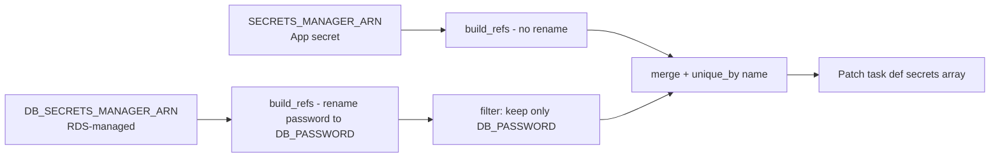

# Build and Deploy to ECS — Pipeline Documentation

End-to-end documentation for [build-deploy-ecs.yml](build-deploy-ecs.yml).

This pipeline builds a Docker image, scans it for vulnerabilities, pushes it to Amazon ECR, then updates an ECS service by registering a new task definition that injects environment variables (from GitHub) and secrets (from AWS Secrets Manager).

---

## 1. Overview

```mermaid
flowchart TB
    A[User triggers workflow_dispatch<br/>selects dev or qa] --> B[Resolve GitHub Environment<br/>backend_dev or backend_qa]
    B --> C[BUILD JOB]
    C --> C1[Checkout external repo via PAT]
    C1 --> C2[OIDC -> assume AWS role]
    C2 --> C3[ECR login]
    C3 --> C4[Generate unique tag<br/>env-sha-timestamp]
    C4 --> C5[docker build]
    C5 --> C6[Trivy scan - fails on HIGH/CRITICAL]
    C6 --> C7[Trivy HTML + JSON reports - uploaded as artifact]
    C7 --> C8[docker push image + env-latest]
    C8 --> D[DEPLOY JOB]
    D --> D1[OIDC -> assume AWS role]
    D1 --> D2[Pull image - verification]
    D2 --> D3[Download current task def]
    D3 --> D4[Inject env vars from GitHub secrets/vars]
    D4 --> D5[Inject secrets from AWS Secrets Manager<br/>app secret + DB secret]
    D5 --> D6[Verify env + secrets present]
    D6 --> D7[Render new task def with image]
    D7 --> D8[Deploy: force-new-deployment]
    D8 --> D9[Wait for service stability]
    D9 --> D10[Container health check]
    D10 --> D11[Deployment summary]
```



---

## 2. Trigger

| Property | Value |
|----------|-------|
| Event | `workflow_dispatch` (manual only) |
| Inputs | `environment` — choice: `dev` \| `qa`, default `dev` |
| Branch | Any (runs on the workflow file branch) |

**To run:** Actions tab → *Build and Deploy to ECS* → Run workflow → pick environment.

---

## 3. Permissions

```yaml
permissions:
  id-token: write   # required for AWS OIDC
  contents: read    # required to read this repo
```

The PAT secret `ORG_PAT` (repo-scoped) is used to check out the **source application repo** (different from the workflow repo).

---

## 4. GitHub Environments

The workflow binds to one of two GitHub Environments based on the input:

| User picks | Bound GitHub Environment |
|------------|---------------------------|
| `dev` | `backend_dev` |
| `qa` | `backend_qa` |

When bound, `${{ vars.* }}` and `${{ secrets.* }}` automatically resolve to that environment's values — **no `if/else` logic in YAML**.

### 4.1 Variables required per environment

| Variable | Purpose | Example |
|----------|---------|---------|
| `AWS_ROLE_ARN` | OIDC role the workflow assumes | `arn:aws:iam::201611060657:role/github-actions-cicd` |
| `AWS_ACCOUNT_ID` | Account number (echo'd, informational) | `201611060657` |
| `ECR_REGISTRY` | ECR registry hostname | `201611060657.dkr.ecr.us-east-1.amazonaws.com` |
| `ECR_REPOSITORY` | ECR repo name | `unsubscribe-backend` |
| `ENV_SUFFIX` | Short tag used in image tags & `-latest` alias | `dev` / `qa` |
| `SOURCE_REPO` | App repo to build | `Unsubscribe-ai/Backend` |
| `SOURCE_REPO_BRANCH` | Branch of source repo | `main` / `qa` |
| `TRIVY_SEVERITY` | Severities that **fail the build** | `HIGH,CRITICAL` |
| `TRIVY_REPORT_SEVERITY` | Severities included in HTML/JSON report | `HIGH,MEDIUM,LOW` |
| `ECS_CLUSTER` | Target ECS cluster name | `unsubscribe-dev-cluster` |
| `ECS_SERVICE` | Target ECS service name | `unsubscribe-dev-service` |
| `ECS_TASK_DEFINITION` | Task definition family name | `unsubscribe-dev` |
| `CONTAINER_NAME` | Name in `containerDefinitions[]` | `backend` |
| `SECRETS_MANAGER_ARN` | App-level secret ARN (JWT, API keys) | `arn:aws:secretsmanager:us-east-1:201611060657:secret:backend/dev/app-AbCdEf` |
| `DB_SECRETS_MANAGER_ARN` | DB credentials secret ARN (RDS-managed) | `arn:aws:secretsmanager:us-east-1:201611060657:secret:rds!db-xxxx` |
| `NODE_ENV` | Per-env Node mode | `development` / `staging` |
| `LOG_LEVEL` | Logger level | `warn` / `info` |
| `PLAID_ENV` | Plaid SDK env | `sandbox` |
| `PLAID_REDIRECT_URI` | Plaid OAuth redirect | `https://app-dev.getunsubscribe.com` |
| `PLAID_WEBHOOK_URL` | Plaid webhook URL | `https://api-dev.../plaid/webhook` |
| `CORS_ORIGIN` | Allowed origin for API | `https://app-dev.getunsubscribe.com` |
| `GOOGLE_REDIRECT_URI` | Google OAuth redirect | `https://app-dev.../auth/google/callback` |
| `GMAIL_REDIRECT_URI` | Gmail OAuth redirect | `https://app-dev.../gmail/callback` |

### 4.2 Secrets required per environment

| Secret | Purpose |
|--------|---------|
| `ORG_PAT` | Cross-repo checkout token (repo:read on source repo) |
| `DB_HOST` | RDS endpoint hostname |
| `DB_PORT` | RDS port (typically `5432`) |
| `DB_USERNAME` | DB user (typically `postgres`) |
| `DB_NAME` | DB name |

> `DB_PASSWORD` is **not** here — it lives in AWS Secrets Manager (`DB_SECRETS_MANAGER_ARN`) and is renamed from `password` -> `DB_PASSWORD` at deploy time.

---

## 5. BUILD JOB — step-by-step

### 5.1 `Display loaded environment configuration`
Prints the resolved values so the run log shows which environment was loaded. Useful for verification.

### 5.2 `Checkout source code from another repo`
Uses `actions/checkout@v4` with `repository`, `ref`, and `token: secrets.ORG_PAT`. Source code lands under `source-code/`.

### 5.3 `Configure AWS credentials via OIDC`
`aws-actions/configure-aws-credentials@v4` assumes `vars.AWS_ROLE_ARN` using GitHub OIDC. No long-lived AWS keys.

### 5.4 `Verify AWS identity`
`aws sts get-caller-identity` confirms which role was assumed.

### 5.5 `Login to Amazon ECR`
`aws-actions/amazon-ecr-login@v2` performs `docker login` for the bound region/account.

### 5.6 `Generate Docker image tag`
Tag format: `<env>-<7charsha>-<YYYYMMDD-HHMMSS>`. Example: `dev-a1b2c3d-20260604-130522`. Exposed as a step output and also `$IMAGE_TAG` env var.

### 5.7 `Build Docker image`
Runs `docker build` inside `source-code/`. Two tags applied:
- `${ECR_REGISTRY}/${ECR_REPOSITORY}:${IMAGE_TAG}` — unique, immutable
- `${ECR_REGISTRY}/${ECR_REPOSITORY}:${ENV_SUFFIX}-latest` — moving alias

Pass-through build arg `--build-arg ENV=$ENV_SUFFIX` available to the Dockerfile.

### 5.8 `Run Trivy vulnerability scanner`
`aquasecurity/trivy-action@master` scans the **just-built local image**.
- `exit-code: '1'` — fails build if any vuln matches `TRIVY_SEVERITY`
- `ignore-unfixed: true` — skip vulns without patches available
- `vuln-type: 'os,library'` — scan both OS packages and language libs

### 5.9 `Download Trivy HTML template` + reports
Downloads the official HTML template and generates two artifacts:
- `trivy-report.html` — human-readable report
- `trivy-report.json` — machine-readable for downstream tooling

Both use `TRIVY_REPORT_SEVERITY` (typically broader than `TRIVY_SEVERITY`) so the report shows more even if not failing.

### 5.10 `Upload Trivy HTML report`
Uploaded as artifact `trivy-html-report-<IMAGE_TAG>`. 30-day retention. Findable in the workflow run summary page.

### 5.11 `Push Docker image to ECR`
Pushes both tags (immutable + `-latest`).

### 5.12 Job outputs (consumed by deploy job)
| Output | Value |
|--------|-------|
| `image_tag` | Tag generated in 5.6 |
| `image_uri` | Full URI with tag |
| `environment` | `backend_dev` or `backend_qa` |

---

## 6. DEPLOY JOB — step-by-step

### 6.1 Job-level config
- `needs: build` — runs only on build success
- `environment: ${{ needs.build.outputs.environment }}` — inherits the same GitHub Environment binding

### 6.2 `Display deploy configuration`
Echoes ECS cluster/service/task-def names for traceability.

### 6.3 `Configure AWS credentials via OIDC`
Same role assumption pattern as build job.

### 6.4 `Login to ECR for pull` + `Pull Docker image from ECR`
Verifies the image is actually present in ECR before attempting to deploy (catches push race conditions).

### 6.5 `Download current task definition`
```bash
aws ecs describe-task-definition --task-definition $ECS_TASK_DEFINITION \
  --query taskDefinition > task-definition.json
```
Saves the **currently active** task definition JSON locally. All subsequent injection steps mutate this file.

### 6.6 `Inject env vars from GitHub secrets`
Writes the container's `environment[]` block. Sources:

| Group | Source | Examples |
|-------|--------|----------|
| Sensitive DB config | `secrets.*` | `DB_HOST`, `DB_PORT`, `DB_USERNAME`, `DB_NAME` |
| Per-env URLs | `vars.*` | `PLAID_REDIRECT_URI`, `CORS_ORIGIN`, `NODE_ENV` |
| Constants | hardcoded | `PORT=5000`, `PLAID_ENABLED=true`, all `CHECK_INTERVAL_*=25` |

**Implementation detail:** Uses `printf 'KEY=VALUE\n' | jq -R -s` to safely build a JSON array regardless of special characters in values. Equivalent to:
```json
[
  {"name":"DB_HOST","value":"..."},
  {"name":"PORT","value":"5000"},
  ...
]
```
Then `jq` rewrites the target container's `environment` field. Writes back to `task-definition.json`.

### 6.7 `Inject Secrets Manager refs`
Builds the container's `secrets[]` block — references that ECS resolves **at task start** using the task execution role.

Reads two Secrets Manager secrets and merges them:



Each entry has format:
```json
{
  "name": "DB_PASSWORD",
  "valueFrom": "arn:aws:secretsmanager:...:secret:rds!db-xxx:password::"
}
```
The `:password::` suffix tells ECS which JSON key to extract from the secret value.

**Key rename:** RDS-managed secrets store `{"password": "...", "username": "..."}` lowercase. The rename map `{"password":"DB_PASSWORD"}` makes the value appear as `$DB_PASSWORD` inside the container, matching what the entrypoint expects.

**Filter:** `select(.name == "DB_PASSWORD")` drops other keys so they don't conflict with `DB_*` already set via `environment[]`.

### 6.8 `Verify env + secrets are present on target container`
Diagnostic step. Fails fast if:
- `CONTAINER_NAME` doesn't match any container in the task def (most common misconfiguration)
- Both `environment[]` and `secrets[]` are empty

Always prints the final arrays so you can audit what's about to deploy.

### 6.9 `Update task definition with new image`
`aws-actions/amazon-ecs-render-task-definition@v1` reads the (already patched) `task-definition.json`, overrides only the target container's `image` field with the new tag, and outputs a path to the final JSON for the next step.

### 6.10 `Deploy updated task to ECS`
`aws-actions/amazon-ecs-deploy-task-definition@v1`:

| Option | Effect |
|--------|--------|
| `force-new-deployment: true` | Always start fresh tasks (picks up rotated secrets even if image unchanged) |
| `wait-for-service-stability: true` | Block until ECS reports the service stable |
| `wait-for-minutes: 10` | Timeout after 10 minutes |

The action calls `RegisterTaskDefinition` (creating a new revision) and `UpdateService` (setting that revision + `--force-new-deployment`).

### 6.11 `Container health check`
After the action returns "stable", an extra script verifies:
1. `runningCount == desiredCount`
2. Every task has `lastStatus == RUNNING`
3. No task has `healthStatus == UNHEALTHY` (only meaningful if the container has a `healthCheck` in the task def)

Exits non-zero on any failure, marking the workflow run as failed even if the ECS deploy reported success.

### 6.12 `Deployment summary`
Prints environment, image URI, tag, cluster, service, triggering user — useful for run-log forensics.

---

## 7. AWS IAM Requirements

### 7.1 OIDC trust policy (on `github-actions-cicd`)
```json
{
  "Version": "2012-10-17",
  "Statement": [{
    "Effect": "Allow",
    "Principal": { "Federated": "arn:aws:iam::201611060657:oidc-provider/token.actions.githubusercontent.com" },
    "Action": "sts:AssumeRoleWithWebIdentity",
    "Condition": {
      "StringEquals": {
        "token.actions.githubusercontent.com:aud": "sts.amazonaws.com"
      },
      "StringLike": {
        "token.actions.githubusercontent.com:sub": "repo:YourOrg/YourRepo:*"
      }
    }
  }]
}
```

### 7.2 Permissions policy (on `github-actions-cicd`)
```json
{
  "Version": "2012-10-17",
  "Statement": [
    { "Effect": "Allow",
      "Action": [
        "ecr:GetAuthorizationToken",
        "ecr:BatchCheckLayerAvailability",
        "ecr:GetDownloadUrlForLayer",
        "ecr:BatchGetImage",
        "ecr:InitiateLayerUpload",
        "ecr:UploadLayerPart",
        "ecr:CompleteLayerUpload",
        "ecr:PutImage"
      ],
      "Resource": "*"
    },
    { "Effect": "Allow",
      "Action": [
        "ecs:DescribeServices",
        "ecs:DescribeTaskDefinition",
        "ecs:DescribeTasks",
        "ecs:ListTasks",
        "ecs:RegisterTaskDefinition",
        "ecs:UpdateService"
      ],
      "Resource": "*"
    },
    { "Effect": "Allow",
      "Action": "iam:PassRole",
      "Resource": [
        "arn:aws:iam::201611060657:role/unsubscribe-*-ecs-task-role",
        "arn:aws:iam::201611060657:role/unsubscribe-*-ecs-task-execution-role"
      ],
      "Condition": { "StringEquals": { "iam:PassedToService": "ecs-tasks.amazonaws.com" } }
    },
    { "Effect": "Allow",
      "Action": "secretsmanager:GetSecretValue",
      "Resource": [
        "arn:aws:secretsmanager:us-east-1:201611060657:secret:backend/*",
        "arn:aws:secretsmanager:us-east-1:201611060657:secret:rds!db-*"
      ]
    }
  ]
}
```

### 7.3 Task Execution Role (used by ECS itself)
Must have:
```json
{
  "Effect": "Allow",
  "Action": ["secretsmanager:GetSecretValue", "kms:Decrypt"],
  "Resource": [
    "arn:aws:secretsmanager:us-east-1:201611060657:secret:backend/*",
    "arn:aws:secretsmanager:us-east-1:201611060657:secret:rds!db-*"
  ]
}
```
Plus the standard `AmazonECSTaskExecutionRolePolicy` AWS-managed policy.

---

## 8. Secret Storage Strategy

| Where | What | Why |
|-------|------|-----|
| **GitHub Environment variables** | URLs, modes, infra refs (Plaid URIs, NODE_ENV, ECS resource names) | Easy to view/edit, no secret rotation needed |
| **GitHub Environment secrets** | DB connection metadata (host, port, user, name) | Sensitive infra info, masked in logs |
| **AWS Secrets Manager - app secret** | JWT secrets, third-party API keys | Rotatable, encrypted at rest |
| **AWS Secrets Manager - DB secret (RDS-managed)** | DB password | Auto-rotation supported by RDS |
| **Hardcoded in workflow** | Constants (ports, intervals, flags) | Same across all environments |

---

## 9. Common Failure Modes

| Symptom | Cause | Fix |
|---------|-------|-----|
| `iam:PassRole ... not authorized` | OIDC role lacks `iam:PassRole` to ECS task roles | Add policy in section 7.2 |
| `Could not find container definition with name X` | `CONTAINER_NAME` var doesn't match task def | Run section 8 verification step output; update `vars.CONTAINER_NAME` |
| `ResourceInitializationError: unable to pull secrets` | Task execution role missing `secretsmanager:GetSecretValue` | Add policy in section 7.3 |
| Container starts but env vars missing | `CONTAINER_NAME` mismatch (jq filter no-op) OR wrong task def revision deployed | Check "Verify env + secrets" step output |
| Trivy fails build | Vuln found at `TRIVY_SEVERITY` level | Patch base image, or temporarily lower `TRIVY_SEVERITY` |
| `same name should not appear in both environment and secrets` | Key duplicated across the two injection steps | Pick one source per key |
| Service stable wait times out | Container failing health check inside ECS | Inspect CloudWatch logs for the task |

---

## 10. Image Tagging & Rollback

Every build produces an **immutable** tag: `<env>-<sha>-<timestamp>`.

To roll back:
1. Find the previous tag from a successful run's logs (or `aws ecr describe-images`).
2. Pin the task def to that image:
   ```bash
   aws ecs update-service \
     --cluster unsubscribe-dev-cluster \
     --service unsubscribe-dev-service \
     --task-definition <previous-task-def-revision> \
     --force-new-deployment
   ```
3. Or rerun a successful old workflow run (re-pushes same SHA but new timestamp).

---

## 11. Secret Rotation Flow

1. Rotate the secret value in AWS Secrets Manager (manual or RDS auto).
2. Re-run the deploy workflow (no code change needed).
3. `force-new-deployment` starts new tasks.
4. ECS fetches the **current** secret value via execution role at task start.
5. New tasks come up with new password; old tasks drain.

No image rebuild required for secret rotation.

---

## 12. Run Time Profile (typical)

| Phase | Time |
|-------|------|
| Build (checkout + docker build + Trivy + push) | 3–6 min |
| Deploy (render + register + force-new-deployment + stability wait) | 2–5 min |
| **Total** | **~5–11 min** |

---

## 13. File Map

| File | Role |
|------|------|
| [build-deploy-ecs.yml](build-deploy-ecs.yml) | The pipeline |
| Source repo's `Dockerfile` | Image build instructions |
| Source repo's `docker-entrypoint.sh` | Builds `DATABASE_URL` from injected `DB_*` env vars, waits for DB, runs migrations, starts server |
| ECS task definition (in AWS) | Template — image, env, secrets are overwritten by this workflow |

---

## 14. Quick Start Checklist

- [ ] OIDC provider configured in AWS IAM
- [ ] `github-actions-cicd` role created with trust policy (section 7.1) + permissions (section 7.2)
- [ ] Task execution role has Secrets Manager read access (section 7.3)
- [ ] GitHub Environments `backend_dev` and `backend_qa` created
- [ ] All variables in section 4.1 populated for each environment
- [ ] All secrets in section 4.2 populated for each environment
- [ ] `ORG_PAT` PAT generated with `repo:read` on the source repo
- [ ] App secret created in AWS Secrets Manager (`backend/<env>/app`)
- [ ] DB secret accessible (RDS-managed or custom)
- [ ] ECS cluster, service, and at least one task definition already exist
- [ ] `CONTAINER_NAME` var matches the actual `containerDefinitions[].name`
- [ ] Trigger workflow → pick `dev` → confirm green run
