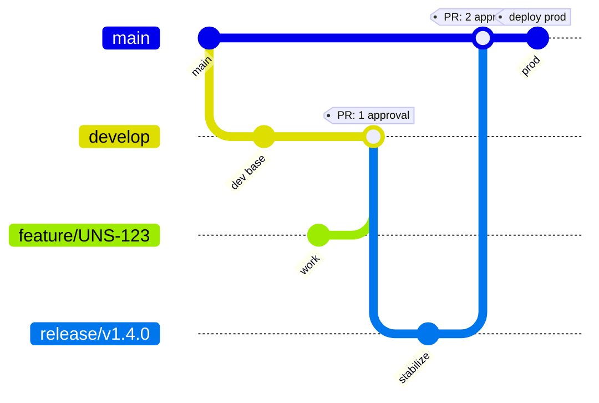

# Branching Strategy & PR Approval Policy

This document defines how branches are organized, how Pull Requests are reviewed, and which branches are allowed to deploy to which environments.

---

## 1. Branches

| Branch | Purpose | Deploys to | Long-lived? |
|---|---|---|---|
| `main` (a.k.a. `master`) | Production-ready code | **prod** | Yes |
| `develop` | Integration branch for in-progress work | dev, qa | Yes |
| `feature/*` | New features (e.g. `feature/gmail-unsubscribe`) | any non-prod (on demand) | No — deleted after merge |
| `bugfix/*` | Non-urgent bug fixes | any non-prod (on demand) | No |
| `hotfix/*` | Urgent prod fixes branched from `main` | prod (after review) | No |
| `release/*` | Release stabilization (optional) | qa, then prod | No |

### Naming convention
```
feature/<ticket-id>-<short-description>
bugfix/<ticket-id>-<short-description>
hotfix/<ticket-id>-<short-description>
release/v<major>.<minor>.<patch>
```
Example: `feature/UNS-123-gmail-batch-unsubscribe`

---

## 2. Flow diagram



### Day-to-day flow
1. Branch off `develop` → `feature/UNS-123-...`
2. Push commits, open PR **into `develop`**
3. PR needs **1 approval** + green CI → merge
4. When `develop` is stable, open PR **`develop` → `main`** (or via `release/*` branch)
5. PR needs **2 approvals** + green CI → merge
6. Merge to `main` triggers prod deploy (manual approval still required in pipeline)

### Hotfix flow
1. Branch off `main` → `hotfix/UNS-456-...`
2. Open PR **into `main`** → 2 approvals → merge → prod deploy
3. **Immediately** open a second PR `main` → `develop` to back-port the fix

---

## 3. PR Approval Rules

### Into `develop`
- **1 reviewer approval required**
- Reviewer must NOT be the PR author
- CI must be green (build + lint + tests + SAST)
- No unresolved review comments
- Branch must be up to date with `develop`

### Into `main` / `master`
- **2 reviewer approvals required**
- At least **one must be a CODEOWNER** (see section 6)
- Reviewer must NOT be the PR author
- CI must be green (build + lint + tests + SAST + SCA + container scan)
- No unresolved review comments
- Branch must be up to date with `main`
- **Stale approvals dismissed** when new commits are pushed

---

## 4. GitHub Branch Protection Settings

Set these under **Settings → Branches → Add rule**.

### Rule for `develop`

| Setting | Value |
|---|---|
| Branch name pattern | `develop` |
| Require a pull request before merging | ON |
| Required approvals | **1** |
| Dismiss stale approvals when new commits are pushed | ON |
| Require review from Code Owners | OFF (optional) |
| Require status checks to pass before merging | ON |
| Required status checks | `build`, `lint`, `test`, `sast` |
| Require branches to be up to date before merging | ON |
| Require conversation resolution before merging | ON |
| Require signed commits | OFF (optional) |
| Require linear history | ON (recommended) |
| Do not allow bypassing the above settings | ON |
| Allow force pushes | **OFF** |
| Allow deletions | **OFF** |

### Rule for `main` (and `master` if both exist)

| Setting | Value |
|---|---|
| Branch name pattern | `main` |
| Require a pull request before merging | ON |
| Required approvals | **2** |
| Dismiss stale approvals when new commits are pushed | ON |
| Require review from Code Owners | **ON** |
| Require status checks to pass before merging | ON |
| Required status checks | `build`, `lint`, `test`, `sast`, `sca`, `container-scan` |
| Require branches to be up to date before merging | ON |
| Require conversation resolution before merging | ON |
| Require signed commits | ON (recommended) |
| Require linear history | ON |
| Include administrators | ON |
| Do not allow bypassing the above settings | ON |
| Restrict who can push to matching branches | Only release managers / team leads |
| Allow force pushes | **OFF** |
| Allow deletions | **OFF** |

---

## 5. Pipeline / Deployment Rules

Pipelines can be **run** from any branch, but each pipeline restricts **which environment it can deploy to** based on the source branch.

| Pipeline | Allowed source branches | Allowed target environments |
|---|---|---|
| Backend ECS | any | `dev`, `qa` |
| Frontend S3 | any | `dev`, `qa` |
| Backend ECS **prod** | `main` only | `prod` |
| Frontend S3 **prod** | `main` only | `prod` |

### Enforcement options

**Option A — GitHub Environment protection rules (recommended)**

Configure on each `*_prod` GitHub Environment:
- **Required reviewers:** at least 1 release manager
- **Deployment branches:** *Selected branches* → `main` only
- **Wait timer:** optional (e.g. 5 min) to allow last-minute cancellation

This way, even if someone manually triggers the prod pipeline from a feature branch, GitHub blocks the deploy job because the source ref is not `main`.

**Option B — In-workflow guard (defense in depth)**

Add this step at the start of every prod deploy job:

```yaml
- name: Verify branch is main
  if: github.event.inputs.environment == 'prod'
  run: |
    if [[ "${GITHUB_REF##*/}" != "main" ]]; then
      echo "ERROR: prod deployments allowed only from 'main' branch."
      echo "Current ref: $GITHUB_REF"
      exit 1
    fi
```

Use **both** Option A and Option B for production.

---

## 6. CODEOWNERS

Create `.github/CODEOWNERS` to automatically request reviews from the right people and to enforce "at least one CODEOWNER approval" on `main`.

Example:
```
# Default owners for everything
*                           @your-org/tech-leads

# Backend
/.github/workflows/*ecs*    @your-org/devops
/backend/                   @your-org/backend-team

# Frontend
/.github/workflows/*s3*     @your-org/devops
/frontend/                  @your-org/frontend-team

# Infrastructure
/terraform/                 @your-org/devops
/.github/                   @your-org/devops
```

---

## 7. Merge Strategy

| Branch | Merge type | Why |
|---|---|---|
| `feature/*` → `develop` | **Squash and merge** | Keeps `develop` history clean — one commit per feature |
| `develop` → `main` | **Merge commit** (no squash) | Preserves full feature history into prod |
| `hotfix/*` → `main` | **Squash and merge** | Single commit per fix |
| `main` → `develop` (back-merge) | **Merge commit** | Preserves the hotfix's exact commits |

Disable other merge methods in **Settings → General → Pull Requests** to enforce this.

---

## 8. Commit Message Convention (recommended)

Use Conventional Commits:
```
<type>(<scope>): <subject>

<body>

<footer>
```
Types: `feat`, `fix`, `chore`, `docs`, `refactor`, `test`, `perf`, `ci`, `build`, `revert`

Examples:
```
feat(auth): add Google OAuth refresh-token rotation
fix(api): handle null email body in Gmail webhook
ci(ecs): scan image with Trivy before push
```

This makes changelog generation and release notes automatic.

---

## 9. Release Tagging

When a `develop` → `main` merge happens:

1. Tag `main` with semver: `git tag -a v1.4.0 -m "Release v1.4.0"`
2. Push tag: `git push origin v1.4.0`
3. Create a **GitHub Release** from the tag with auto-generated release notes.
4. The prod deploy pipeline can be triggered from the tag (immutable reference).

Use this versioning:
- **MAJOR** — breaking API change
- **MINOR** — new backwards-compatible feature
- **PATCH** — backwards-compatible bug fix

---

## 10. Summary Table

| Concern | `develop` | `main` |
|---|---|---|
| Required PR approvals | 1 | 2 |
| CODEOWNERS approval required | Optional | Yes |
| Stale approvals dismissed on push | Yes | Yes |
| Required CI checks | build, lint, test, sast | build, lint, test, sast, sca, container-scan |
| Force push allowed | No | No |
| Branch deletion allowed | No | No |
| Linear history required | Yes | Yes |
| Can deploy to dev/qa | Yes (any branch can) | Yes |
| Can deploy to prod | No | **Yes (only `main`)** |
| Merge strategy | Squash | Merge commit |

---

## 11. Quick Checklist for Setup

- [ ] Create/confirm `main` and `develop` branches exist
- [ ] Add branch protection rule for `develop` (section 4)
- [ ] Add branch protection rule for `main` (section 4)
- [ ] Create `.github/CODEOWNERS` file (section 6)
- [ ] Configure GitHub Environments `*_prod` with `main`-only deployment branches (section 5)
- [ ] Add `Verify branch is main` step to prod deploy jobs (section 5)
- [ ] Disable squash/rebase/merge methods you don't want in repo settings (section 7)
- [ ] Document the strategy in the repo README and link to this file
- [ ] Communicate the policy to the team
